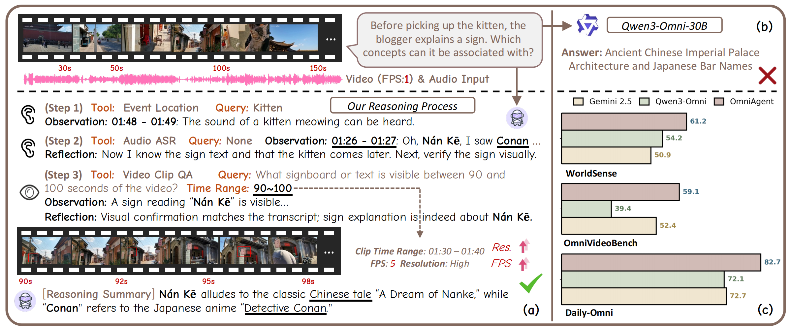

# OmniAgent: Audio-Guided Active Perception Agent for Omnimodal Audio-Video Understanding

[Keda Tao](https://kd-tao.github.io/), [Wenjie Du](https://kurt232.github.io/), [Bohan Yu](), [Weiqiang Wang](), [Jian liu](), [Huan Wang](https://huanwang.tech/), "OmniAgent: Audio-Guided Active Perception Agent for Omnimodal Audio-Video Understanding"

[[Paper]()]

#### 🔥🔥🔥 News

- **2025-12-30**: The paper is released.
- **2025-12-28:** This repo is released.





> **Abstract:** Omnimodal large language models have made significant strides in unifying audio and visual modalities; however, they often lack the fine-grained cross-modal understanding and have difficulty with multimodal alignment. To address these limitations, we introduce OmniAgent, a fully audio-guided active perception agent that dynamically orchestrates specialized tools to achieve more fine-grained audio-visual reasoning. Unlike previous works that rely on rigid, static workflows and dense frame-captioning, this paper demonstrates a paradigm shift from passive response generation to active multimodal inquiry. OmniAgent employs dynamic planning to autonomously orchestrate tool invocation on demand, strategically concentrating perceptual attention on task-relevant cues. Central to our approach is a novel coarse-to-fine audio-guided perception paradigm, which leverages audio cues to localize temporal events and guide subsequent reasoning. Extensive empirical evaluations on three audio-video understanding benchmarks demonstrate that OmniAgent achieves state-of-the-art performance, surpassing leading open-source and proprietary models by substantial margins of 10% - 20% accuracy.

## ⚒️ TODO

* [] Release code 

## Citation

If you find this work useful for your research, please consider citing our paper:

```bibtex
coming soon
```