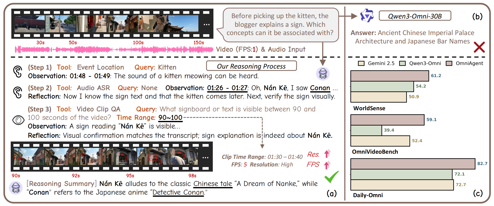

# OmniAgent: Active Perception Agent for Omnimodal Audio-Video Understanding

[Keda Tao](https://kd-tao.github.io/), [Wenjie Du](https://kurt232.github.io/), [Bohan Yu](), [Weiqiang Wang](), [Jian liu](), [Huan Wang](https://huanwang.tech/), "OmniAgent: Active Perception Agent for Omnimodal Audio-Video Understanding"

[[Paper](https://arxiv.org/abs/2512.23646)]

#### 🔥🔥🔥 News

- **2026-03-11**: **The code is released!**
- **2025-12-30**: The paper is released.
- **2025-12-28:** This repo is released.





> **Abstract:** Omnimodal large language models have made significant strides in unifying audio and visual modalities; however, they often lack the fine-grained cross-modal understanding and have difficulty with multimodal alignment. To address these limitations, we introduce OmniAgent, a fully audio-guided active perception agent that dynamically orchestrates specialized tools to achieve more fine-grained audio-visual reasoning. Unlike previous works that rely on rigid, static workflows and dense frame-captioning, this paper demonstrates a paradigm shift from passive response generation to active multimodal inquiry. OmniAgent employs dynamic planning to autonomously orchestrate tool invocation on demand, strategically concentrating perceptual attention on task-relevant cues. Central to our approach is a novel coarse-to-fine audio-guided perception paradigm, which leverages audio cues to localize temporal events and guide subsequent reasoning. Extensive empirical evaluations on three audio-video understanding benchmarks demonstrate that OmniAgent achieves state-of-the-art performance, surpassing leading open-source and proprietary models by substantial margins of 10% - 20% accuracy.

## ⚒️ TODO

* [x] Release code 
* [x] Release paper 
* [ ] Build a Gradio demo
* [ ] Support more models or API

## Install

Install our codebase:
```bash
git https://github.com/KD-TAO/OmniAgent.git
cd OmniAgent
```
Install the dependencies:
```bash
pip install -r requirements.txt
```

## Quick Start

Firstly, set your own API KEY in **omni_agent/config.py**
```bash
OPENAI_API_KEY = "OPENAI"
YOUR_API_KEY_GEMINI = "GEMINI"
YOUR_API_KEY_QWEN = "QWEN"
```
You can freely provide the API KEY. Regarding the selection of the tool models, we currently support the Gemini series and the Qwen series:
```bash
# ------------------ Tool configuration ------------------ #
VIDEO_TOOL = "QWEN"
ASR_GC_TOOL = "QWEN"
LOCATION_TOOL = "GEMINI"
```
More about the basic settings can all be completed in **omni_agent/config.py**.

Then, you can quickly run the demo to perform reasoning on the example input or input the video path and the question by yourself.

```bash
python main.py
```
```bash
python main.py --video_path YOUR_VIDEO --question "YOUR_Q"
```

## Citation

If you find this work useful for your research, please consider citing our paper:

```bibtex
@article{tao2025omniagent,
  title={OmniAgent: Audio-Guided Active Perception Agent for Omnimodal Audio-Video Understanding},
  author={Tao, Keda and Du, Wenjie and Yu, Bohan and Wang, Weiqiang and Liu, Jian and Wang, Huan},
  journal={arXiv preprint arXiv:2512.23646},
  year={2025}
}
```